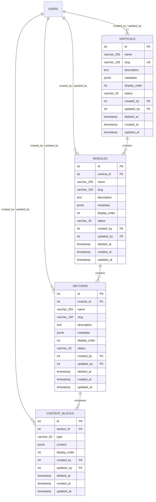

# Phase 4 — Content Management: Database Design
(extended into Phase 5 — Learner API, Phase 6 — Enrollment + Progress)

**Status:** Phase 4 (4.1–4.7) complete, approved, applied, and tested. Phase 5
learner API surface complete and tested. Phase 6 enrollment + progress
complete and tested. See §13 and §14 for the respective details.

---

## 1. Decisions locked (from review)

| # | Decision | Implication |
|---|---|---|
| 1 | Audit fields `created_by`, `updated_by` → `users(id)` on **all four** content entities (incl. `content_blocks`). `published_by` reserved for future. | Every write to content is attributable. |
| 2 | `metadata JSONB` on `verticals`, `modules`, `sections` only — default `'{}'::jsonb`. | Reserved for icons, covers, tags, difficulty, learning time, theme, custom settings. |
| 3 | `name` = `VARCHAR(255)`, `slug` = `VARCHAR(150)`, `description` = `TEXT` (no length cap). | Postgres-native unbounded text for educational copy; finite text for identifier-like fields. |
| 4 | Block `type` = `VARCHAR(50)`. **No DB ENUM.** Validation in Express only. v1: `text`, `image`, `video`, `quiz`. | Future kinds (pdf, code, table, carousel, callout, …) added via validator change — no migration. |
| 5 | Backend owns slug generation. Auto-slugify from `name`, accept client override, ensure global uniqueness with numeric suffix (`tkr`, `tkr-2`, `tkr-3`, …). | Stable, URL-safe slugs without client discipline. |
| 6 | `display_order` on **all four** entities. Renderer uses `display_order`, never `created_at`. | Deterministic ordering. |
| 7 | Workflow via `status` column. Values: `draft` → `review` → `published` → `archived`. Editors edit drafts; admins publish; Flutter consumes only `published`. | Single source of truth for visibility, no `is_published` column. |
| 8 | Primary keys = SERIAL integers. No UUIDs. | Project-wide convention; keeps SQL fundamentals the focus. |
| 9 | Soft delete via `deleted_at TIMESTAMPTZ NULL` (active when NULL). | Restoration, audit, future recycle bin. |
| 10 | No `version` column yet. Schema designed so adding `version INTEGER NOT NULL DEFAULT 1` later is mechanical. | Version history is Phase X (future feature). |
| 11 | Section only organizes ordered Content Blocks — no payload columns on `sections`. | CMS-style composition (Strapi / Directus / Notion style). |
| 12 | NO SQL YET. ERD + this design doc for approval first. | One gate at a time. |
| 13 | Empty-slug fallback: if `name` produces an empty slug (non-Latin, punctuation-only), use `item-{shortId}` where `shortId` is the new row's PK or a 6-char base36 of `nanoid`. | Never produces empty string. |
| 14 | Client-supplied slug collisions follow the same `-N` suffix rule as auto-generated slugs. | UNIQUE constraint is never violated by the slugifier. |
| 15 | Slug is sticky on rename — set once on create, never re-derived on update. A user-initiated rename uses the same generator + suffix logic; a `name` change does not auto-fire it. | Stable URLs for Flutter deep links / future R2 paths. |
| 16 | Slug suffix reservation: reserve at least 4 chars for `-NNN`; truncate base to ≤146 chars when base+suffix would exceed `VARCHAR(150)`. | Predictable suffix behavior. |
| 17 | Block `type` allowed-list is a single source-of-truth constant `ALLOWED_BLOCK_TYPES` exported from `utils/validators/blockType.js`. v1: `text`, `image`, `video`, `quiz`. | One place to add a new type. |
| 18 | Publishing state machine (V/M/S) — see §7 for full table. Transitions into `published` require admin; transitions out of `published` (recall, archive) require admin; transitions between `draft` and `review` are open to admin+editor. Anything not in the table is 400. Role failures on legal transitions are 403. Same-status updates are no-ops (always 200). | The API itself enforces the workflow — clients can't bypass it. |
| 19 | `status` on POST is ignored. New V/M/S rows always start at `draft`. | No import / seed-data escape hatch in v1 — adding one is a separate endpoint. |
| 20 | `published_at TIMESTAMPTZ NULL` and `published_by INTEGER NULL FK→users(id)` on V/M/S. Set on any transition INTO `published`; preserved across unpublish / archive cycles; updated on re-publish. Not cleared on transitions out of `published`. | `published_at` is "most recent publish time" — historical record preserved. |
| 21 | Publishing controllers apply the state machine inline in PUT (no separate `/publish` / `/unpublish` endpoints). Single API, simpler client code. Separate endpoints can come later when publishing metadata (schedule, release notes, changelog) is needed. | v1 keeps the surface minimal. |
| 22 | Media storage backend is the caller's choice (URL registration). v1 has no backend-side upload. Actual file upload (R2 presigned PUT, local multipart) is a follow-up phase. The `media` table is a metadata library keyed by the unique URL — no FK constraints to image / video block `content` fields. | URLs flow into image / video content blocks and V/M/S `metadata` as plain strings; the media row is a lookup library, not a source of truth. |
| 23 | Editors see and delete only their own media. Admins see and delete all. `?ownerId=N` query filter is admin-only (editors attempting to scope by another owner get 403). | The "my media" vs "all media" affordance is essential for an asset library used by multiple editors. |
| 24 | Soft delete only on media. Hard delete / recycle-bin purge is a future admin action. The unique URL constraint is `WHERE deleted_at IS NULL`, so a URL can be re-registered after a soft-delete cycle. | Forward-compatible with hard-delete and audit-log features. |
| 25 | Learner API surface lives under `/api/learn/*`, distinct from `/api/verticals`, `/api/modules`, `/api/sections`, `/api/content-blocks`. The writer endpoints serve editors + admins with full audit fields; the learner endpoints serve any authenticated user with a stripped-down response shape (no `created_by` / `updated_by` / `published_by` / `deleted_at`). | Different audiences, different shapes, different semantics — easier to reason about and to cache separately. |
| 26 | The tree endpoint `GET /api/learn/verticals/:id/tree` returns the full V → M → S → blocks hierarchy in one response, with assembly done in JavaScript from 4 round trips (1 per level). Useful for Flutter's "open the catalog" flow without N round trips. No pagination on tree nodes in v1 — verticals with many modules / sections will get bigger. | Convenience endpoint, not the canonical model — list endpoints per level remain primary. |
| 27 | No writes on `/api/learn`. All mutations continue to flow through the admin paths. The learner surface is strictly read-only. | A user with a learner JWT cannot accidentally (or adversarially) mutate content even by guessing URLs. |
| 28 | Cross-parent visibility: getting a published module requires its vertical to be published; getting a published section requires its module + vertical to be published; getting a content block requires its section + module + vertical to be published. Enforced via JOINs in the get-by-id paths. Children of non-published parents are invisible — they don't leak via direct URLs. | The publishing flow is opt-in per item, but visibility is transitive — no orphan published children. |
| 29 | Any authenticated role (admin / editor / user) can read published content on `/api/learn`. The user's role is not used in the query — JWT validity alone is the gate. Staff previewing their own work in the Flutter app is a normal use case. | One code path, no role branching; only the writer endpoints differentiate by role. |
| 30 | Enrollment scope is the **vertical** for v1 — one row per `(user, vertical)` UNIQUE. Module / section enrollment is future work. | A "course" maps to a vertical; learners don't enroll per module or section. |
| 31 | Vertical and section completion are **derived by aggregation** from `content_progress`. No separate `section_progress` or `vertical_progress` tables. | Single source of truth. Aggregation done at read time via CTE — acceptable for v1 scale. |
| 32 | Status enums are CHECK constraints, not PostgreSQL ENUM types. Two enums: enrollment `(active, completed, dropped)` and progress `(started, completed)`. | Adding a status = migration + validator edit. No DB-level ENUM evolution needed. |
| 33 | Enrollments and progress are strictly user-scoped. `req.user.id` is the only subject — `userId` is never read from query or body. | Even a malicious user sending `{userId: 99999}` cannot impersonate. The JWT is authoritative. |
| 34 | Enroll / start / complete are idempotent upserts: POST returns 201 on first write, 200 on subsequent writes. DELETE on already-dropped returns 200 with `alreadyDropped: true`. Re-enroll after drop is UPDATE (200), not INSERT. | Clients can retry without idempotency keys. Server logic is just SQL upserts. |
| 35 | A vertical must be published for enroll. Draft / archived / deleted verticals return 404 on enroll / progress endpoints. Same JOIN-based cross-parent visibility rule as Phase 5. | Direct URLs cannot leak unpublished verticals into a learner's "my courses" list. |
| 36 | When the last unfinished block in a vertical is completed, the enrollment is **auto-promoted** to `status = 'completed'` with `completed_at = now()`. One-way — no auto-uncomplete. | Natural "I finished this course" signal. Re-enrolling (POST after drop) resets it back to `active`. |
| 37 | Progress reads of a block whose parent chain is no longer fully published return 404 — even if prior progress data exists for that block. | Visibility trumps history. A block demoted to draft is invisible; the progress row is preserved (no hard delete). |

---

## 2. Entity Relationship Diagram

### 2.1 Mermaid (renders in GitHub, most markdown viewers, mermaid.live)



### 2.2 Hierarchy (text view)

```
users
 ├── verticals           (1 row per top-level domain; UNIQUE slug)
 │    └── modules        (N rows per vertical; UNIQUE slug within vertical)
 │         └── sections  (N rows per module; UNIQUE slug within module)
 │              └── content_blocks  (N rows per section, ordered by display_order)
```

### 2.3 Relationship summary

| Parent | Child | Cardinality | FK in child |
|---|---|---|---|
| `users` | each of the 4 content tables | 1-to-many | `created_by`, `updated_by` (nullable) |
| `verticals` | `modules` | 1-to-many | `modules.vertical_id` |
| `modules` | `sections` | 1-to-many | `sections.module_id` |
| `sections` | `content_blocks` | 1-to-many | `content_blocks.section_id` |

All FKs use `ON DELETE RESTRICT`. Soft-delete is the intended removal path.

---

## 3. Entity: `verticals`

| Field | Type | Null | Default | Notes |
|---|---|---|---|---|
| `id` | `SERIAL` | NO | auto | PK |
| `name` | `VARCHAR(255)` | NO | – | Display name |
| `slug` | `VARCHAR(150)` | NO | – | UNIQUE globally; auto-generated, client may override |
| `description` | `TEXT` | YES | NULL | Long educational copy |
| `metadata` | `JSONB` | NO | `'{}'::jsonb` | Icon, cover, tags, custom settings |
| `display_order` | `INTEGER` | NO | `0` | Render order |
| `status` | `VARCHAR(20)` | NO | `'draft'` | CHECK: `draft`/`review`/`published`/`archived` |
| `created_by` | `INTEGER` | YES | NULL | FK → `users(id)` ON DELETE RESTRICT |
| `updated_by` | `INTEGER` | YES | NULL | FK → `users(id)` ON DELETE RESTRICT |
| `deleted_at` | `TIMESTAMPTZ` | YES | NULL | Soft delete (NULL = active) |
| `created_at` | `TIMESTAMPTZ` | NO | `CURRENT_TIMESTAMP` | |
| `updated_at` | `TIMESTAMPTZ` | NO | `CURRENT_TIMESTAMP` | Bumped by application on every update |

**Uniqueness:** `UNIQUE (slug)`
**Indexes:**
- PK on `id`
- UNIQUE on `slug`
- Partial on `(status)` `WHERE deleted_at IS NULL`
- Partial on `(display_order)` `WHERE deleted_at IS NULL`
- GIN on `metadata` `WHERE deleted_at IS NULL`

---

## 4. Entity: `modules`

| Field | Type | Null | Default | Notes |
|---|---|---|---|---|
| `id` | `SERIAL` | NO | auto | PK |
| `vertical_id` | `INTEGER` | NO | – | FK → `verticals(id)` ON DELETE RESTRICT |
| `name` | `VARCHAR(255)` | NO | – | |
| `slug` | `VARCHAR(150)` | NO | – | UNIQUE within `(vertical_id)` |
| `description` | `TEXT` | YES | NULL | |
| `metadata` | `JSONB` | NO | `'{}'::jsonb` | |
| `display_order` | `INTEGER` | NO | `0` | |
| `status` | `VARCHAR(20)` | NO | `'draft'` | CHECK: same 4 values |
| `created_by` | `INTEGER` | YES | NULL | FK → `users(id)` ON DELETE RESTRICT |
| `updated_by` | `INTEGER` | YES | NULL | FK → `users(id)` ON DELETE RESTRICT |
| `deleted_at` | `TIMESTAMPTZ` | YES | NULL | |
| `created_at` | `TIMESTAMPTZ` | NO | `CURRENT_TIMESTAMP` | |
| `updated_at` | `TIMESTAMPTZ` | NO | `CURRENT_TIMESTAMP` | |

**Uniqueness:** `UNIQUE (vertical_id, slug)`
**Indexes:**
- PK on `id`
- UNIQUE on `(vertical_id, slug)`
- Partial on `(vertical_id)` `WHERE deleted_at IS NULL`
- Partial on `(status)` `WHERE deleted_at IS NULL`
- Partial on `(display_order)` `WHERE deleted_at IS NULL`
- GIN on `metadata` `WHERE deleted_at IS NULL`

---

## 5. Entity: `sections`

| Field | Type | Null | Default | Notes |
|---|---|---|---|---|
| `id` | `SERIAL` | NO | auto | PK |
| `module_id` | `INTEGER` | NO | – | FK → `modules(id)` ON DELETE RESTRICT |
| `name` | `VARCHAR(255)` | NO | – | |
| `slug` | `VARCHAR(150)` | NO | – | UNIQUE within `(module_id)` |
| `description` | `TEXT` | YES | NULL | |
| `metadata` | `JSONB` | NO | `'{}'::jsonb` | |
| `display_order` | `INTEGER` | NO | `0` | |
| `status` | `VARCHAR(20)` | NO | `'draft'` | CHECK |
| `created_by` | `INTEGER` | YES | NULL | FK → `users(id)` ON DELETE RESTRICT |
| `updated_by` | `INTEGER` | YES | NULL | FK → `users(id)` ON DELETE RESTRICT |
| `deleted_at` | `TIMESTAMPTZ` | YES | NULL | |
| `created_at` | `TIMESTAMPTZ` | NO | `CURRENT_TIMESTAMP` | |
| `updated_at` | `TIMESTAMPTZ` | NO | `CURRENT_TIMESTAMP` | |

**Uniqueness:** `UNIQUE (module_id, slug)`
**Indexes:** same shape as `modules` (substitute `module_id` for `vertical_id`).

---

## 6. Entity: `content_blocks`

> Distinct from V/M/S: **no name, no slug, no description, no metadata, no status**.
> Visibility flows from the parent section's status.

| Field | Type | Null | Default | Notes |
|---|---|---|---|---|
| `id` | `SERIAL` | NO | auto | PK |
| `section_id` | `INTEGER` | NO | – | FK → `sections(id)` ON DELETE RESTRICT |
| `type` | `VARCHAR(50)` | NO | – | One of `text`/`image`/`video`/`quiz` (v1). Validation lives in Express; DB has NO CHECK on values. |
| `content` | `JSONB` | NO | `'{}'::jsonb` | Block payload. Per-type shape documented in Phase 4.5. |
| `display_order` | `INTEGER` | NO | `0` | Order within the parent section |
| `created_by` | `INTEGER` | YES | NULL | FK → `users(id)` ON DELETE RESTRICT |
| `updated_by` | `INTEGER` | YES | NULL | FK → `users(id)` ON DELETE RESTRICT |
| `deleted_at` | `TIMESTAMPTZ` | YES | NULL | |
| `created_at` | `TIMESTAMPTZ` | NO | `CURRENT_TIMESTAMP` | |
| `updated_at` | `TIMESTAMPTZ` | NO | `CURRENT_TIMESTAMP` | |

**Indexes:**
- PK on `id`
- Partial on `(section_id)` `WHERE deleted_at IS NULL`
- Partial on `(display_order)` `WHERE deleted_at IS NULL`
- Partial on `(type)` `WHERE deleted_at IS NULL`
- GIN on `content` `WHERE deleted_at IS NULL`

---

## 7. Workflow semantics

`status ∈ {'draft', 'review', 'published', 'archived'}` enforced by CHECK constraint.

| State | Visible to editor? | Visible to admin? | Visible to Flutter learner? |
|---|---|---|---|
| `draft` | yes | yes | no |
| `review` | yes | yes | no |
| `published` | yes | yes | **yes** |
| `archived` | yes (filtered by default) | yes | no |

### 7.1 State machine (locked decision #18)

Enforced inline in the V/M/S `update` controllers via `validateStatusTransition` in
`utils/validators/status.js`. Single API — no separate `/publish` / `/unpublish`
endpoints in v1.

| From      | To          | Required role | HTTP on failure | Notes |
|-----------|-------------|---------------|-----------------|-------|
| `draft`   | `draft`     | (any)         | —               | no-op |
| `draft`   | `review`    | (any)         | —               | submit |
| `draft`   | `published` | —             | 400             | **illegal** — must go through review |
| `draft`   | `archived`  | —             | 400             | **illegal** — must publish first then archive, or self-reject to draft and review |
| `review`  | `draft`     | (any)         | —               | reject / recall |
| `review`  | `review`    | (any)         | —               | no-op |
| `review`  | `published` | **admin**     | 403             | approve / publish |
| `review`  | `archived`  | —             | 400             | **illegal** — must publish first, then archive |
| `published` | `draft`   | **admin**     | 403             | unpublish / recall for fixes |
| `published` | `published` | (any)       | —               | no-op |
| `published` | `archived` | **admin**    | 403             | retire |
| `archived` | `draft`     | **admin**    | 403             | unarchive / restore |
| `archived` | `archived`  | (any)        | —               | no-op |
| `archived` | `review`    | —             | 400             | **illegal** — must restore to draft first |
| `archived` | `published` | —             | 400             | **illegal** — must go through draft → review |

**Roles:**
- `editor` — can submit / reject their own work (transitions within `{draft, review}`)
- `admin` — can do everything, including all transitions into and out of `published`

**HTTP status mapping:**
- Illegal transition (pair not in table): **400** (`illegal status transition: <from> -> <to>`)
- Legal transition attempted by wrong role: **403** (`Only <role>s can transition status from <from> to <to>`)
- Invalid status value: **400** (`status must be one of: draft, review, published, archived`)

### 7.2 On create (locked decision #19)

`req.body.status` is **ignored**. New V/M/S rows always start as `draft` regardless of what the client sends. v1 has no import / seed-data escape hatch.

### 7.3 Audit fields (locked decision #20)

`published_at TIMESTAMPTZ NULL` and `published_by INTEGER NULL FK→users(id)` on
`verticals` / `modules` / `sections`. Behaviour:

- Set together on any transition INTO `published` (`published_at = CURRENT_TIMESTAMP`, `published_by = req.user.id`).
- **Preserved** across any subsequent transition OUT OF `published` (unpublish / archive).
- **Updated** on re-publish from a non-published state (so `published_at` always means "most recent publish time").
- Not populated by editor submit / reject — those don't stamp publish metadata.

### 7.4 Why no separate transition endpoints (locked decision #21)

The state machine lives entirely inside the PUT handlers. This keeps the API
surface to one update endpoint per entity and the client code one path. If a
later phase needs publish metadata (release notes, scheduled publishes,
changelog), a `/publish` endpoint can be added — it would dispatch to the same
state machine and then add the metadata side effects.

---

## 8.5 Media library (Phase 4.7)

A metadata library for URLs pointing at externally-hosted assets (Cloudflare R2
in production, CDN, third-party hosts in dev/test). v1 is URL registration only
— no backend-side upload. The actual file-upload flow (R2 presigned PUT, local
multipart) is a follow-up phase.

### Schema

`media` table — see `db/schema/phase4_7_media.sql`:

| Field | Type | Notes |
|---|---|---|
| `id` | `SERIAL` PK | |
| `owner_id` | `INTEGER` FK→users | The uploader. Editors see only their own. |
| `url` | `TEXT` NOT NULL | UNIQUE among active rows |
| `original_filename` | `VARCHAR(255)` | |
| `content_type` | `VARCHAR(100)` | MIME format |
| `size_bytes` | `BIGINT` | Required (caller knows the file size) |
| `kind` | `VARCHAR(20)` | image / video / audio / document / other |
| `width`, `height` | `INTEGER NULL` | image / video |
| `duration_seconds` | `INTEGER NULL` | video / audio |
| `deleted_at` | `TIMESTAMPTZ NULL` | Soft delete |
| audit fields | | standard |

Indexes:
- `UNIQUE (url) WHERE deleted_at IS NULL`
- Partial on `(owner_id)`, `(kind)`, `(created_at DESC)` all `WHERE deleted_at IS NULL`

### Endpoints

| Method | Path | RBAC | Notes |
|---|---|---|---|
| `GET` | `/api/media` | admin+editor | Paginated, filtered; editors scoped to `owner_id = self` by default |
| `GET` | `/api/media/:id` | admin+editor | Editor gets own only (403 on others') |
| `POST` | `/api/media` | admin+editor | Register URL + metadata; unique URL enforced (409 on duplicate) |
| `DELETE` | `/api/media/:id` | admin+editor | Admin deletes any; editor deletes own only |

Query params on list: `?kind=...`, `?ownerId=N` (admin-only), `?includeDeleted=true` (admin-only).

### Validation

- `url` must parse as `http://` or `https://` — rejects `javascript:`, `data:`, `ftp:`, etc.
- `originalFilename` non-empty after trim, max 255 chars
- `contentType` matches `^type/subtype` MIME shape
- `sizeBytes` is a positive integer ≤ 100 MB
- `kind` ∈ {image, video, audio, document, other}; defaults to `other`
- `width` / `height` / `durationSeconds` optional non-negative integers

### How it integrates

Image and video block `content` JSONB references URLs as plain strings. The
media row is a lookup library — `content_blocks.content.image.url` does NOT
have a FK to `media(id)`. Validation of "is this URL in our library?" is a
future concern; v1 just stores the URL string in the block content.


---

## 8. Slug generation policy (server-side, `utils/slug.js` — Phase 4.2)

1. **If request body includes a non-empty `slug`:**
   a. Validate against `^[a-z0-9-]+$`.
   b. Apply the same `-N` suffix rule (step 4) on collisions. Client-supplied slugs never bypass uniqueness.

2. **Else derive from `name`:**
   a. Lowercase.
   b. Replace whitespace and any char outside `[a-z0-9-]` with `-`.
   c. Collapse repeats, trim leading/trailing `-`.
   d. If the result is empty (non-Latin name, punctuation-only) → fall back to `item-{shortId}` where `shortId` is the new row's PK or a 6-char base36 of `nanoid`. Never return empty string.

3. **Enforce uniqueness within scope:**
   - Vertical: globally.
   - Module: within the same `vertical_id`.
   - Section: within the same `module_id`.

4. **On collision, append `-2`, `-3`, `-4`, …** until unique. The suffix counter is per scope (so verticals and modules with the same name in different parents do NOT collide).

5. **Truncation rule:** reserve at least 4 chars for `-NNN`. If `base + suffix` would exceed `VARCHAR(150)`, truncate `base` to ≤146 chars before appending suffix.

6. **Rename behavior:** slug is set once on create and is **never re-derived** on update. A user-initiated rename (separate "Edit slug" affordance) uses the same generator + suffix logic, but a `name` change does NOT auto-fire it. Slug stays stable for Flutter deep links / future R2 paths.

Library: `slugify` npm package (single dep, zero non-dev deps), with the empty-string fallback in step 2d handling the non-Latin case.

---

## 9. Soft delete semantics

- `deleted_at IS NULL`  ⇢  active.
- `deleted_at` set ⇢ soft-deleted (audit/restoration only).
- Every query in CRUD endpoints will filter `WHERE deleted_at IS NULL` by default.
- Optional `?includeDeleted=true` query param (admin-only) bypasses the filter for trash UI.
- Hard delete is reserved for admin's recycle-bin "purge" action, scope of a later phase.

---

## 10. Future extension points (NOT in 4.1)

These are intentionally **not** added now but the design supports them without disruptive redesign:

| Feature | Hook |
|---|---|
| New V/M/S-level fields (icon, cover, tags, difficulty, learning time, theme, custom settings) | Store under `metadata` JSONB on `verticals`/`modules`/`sections`. **No schema change required** — only the application reads/writes the new key. |
| New block-payload keys for existing block types | Store under `content` JSONB on `content_blocks`. Same — no schema change required. |
| `published_by` (audit who published) | Add column to all 4 tables; populated by Phase 4.6 transition endpoint. |
| `version` (content versioning) | Add `version INTEGER NOT NULL DEFAULT 1` to all 4 tables; pair with a future `content_versions` table storing snapshots. |
| Audit log | Separate `audit_log` table; populated by triggers or controller middleware. |
| Search | GIN indexes already on `metadata` and `content` JSONB; later add a `tsvector` column for full-text. |
| Localization | `metadata JSONB` and `content JSONB` are the natural extension surfaces. |
| Progress / Favorites / Bookmarks / Notes | Future sibling tables keyed by `user_id` + entity FKs. |
| Media (`images`, `videos`) | Phase 4.7 — separate `media` table; URLs flow into V/M/S `metadata` and `content_blocks.content`. |
| Recycle bin / purge | Future admin endpoint operating on `deleted_at IS NOT NULL` rows. |

---

## 11. Explicitly out of scope for Phase 4.1

- No SQL yet.
- No migration runner / `schema_migrations` table (proposed when applying).
- No controllers, routes, validators, or controllers — those come in Phases 4.2–4.6.
- No seed data.
- No dashboard wiring (Phase 3 placeholder updates happen once migrations apply).
- No workflow transition endpoints (Phase 4.6).
- No media table (Phase 4.7).
- The `ALLOWED_BLOCK_TYPES` constant in `utils/validators/blockType.js` is the single source of truth for block-type validation. Adding a new type = edit that file + the per-type payload validator; no DB migration.
- `metadata` JSONB (V/M/S) and `content` JSONB (`content_blocks`) are the agreed extension surfaces for new fields. Adding a field = write a default in the controller + read it back; no DB migration.

---

## 12. Approval gate — superseded, all built

All Phase 4 sub-phases (4.1 through 4.7) have been implemented, tested (200+
live assertions across the suite), and deployed. No further approval gate on
this doc for Phase 4.

---

## 13. Phase 5 — Learner API surface

Read-only consumer surface under `/api/learn/*`. Serves the Flutter learner
app and any other consumer that should see only the *publicly published* V/M/S
tree.

### 13.1 Endpoints

| Method | Path | Purpose |
|---|---|---|
| GET | `/api/learn/verticals` | List published verticals (paginated, `?search`) |
| GET | `/api/learn/verticals/:id` | One published vertical |
| GET | `/api/learn/verticals/:id/tree` | Full V → M → S → blocks in one response |
| GET | `/api/learn/verticals/:id/modules` | Published modules of a vertical |
| GET | `/api/learn/modules/:id` | One published module (parent vertical must be published) |
| GET | `/api/learn/modules/:id/sections` | Published sections of a module |
| GET | `/api/learn/sections/:id` | One published section (parent chain must be published) |
| GET | `/api/learn/sections/:id/blocks` | Content blocks of a published section (`?type=text\|image\|video\|quiz`) |
| GET | `/api/learn/blocks/:id` | One content block (parent chain must be published) |

All endpoints require authentication (any role: admin / editor / user).
Admin-only endpoints remain under `/api/verticals`, `/api/modules`, etc.

### 13.2 Visibility rules

| Resource | Visibility rule |
|---|---|
| Vertical | `status = 'published'` AND `deleted_at IS NULL` |
| Module | published AND parent vertical is published AND not deleted |
| Section | published AND parent module is published AND parent vertical is published AND not deleted |
| Content block | parent section is published AND parent chain is published AND not deleted |

The get-by-id paths enforce cross-parent visibility via JOINs. A published
section inside a draft module is invisible — direct URLs return 404.

### 13.3 Response shape

Omits the writer-surface audit fields:

```json
{
  "id": 1,
  "name": "...",
  "slug": "...",
  "description": "...",
  "metadata": {},
  "display_order": 0,
  "published_at": "...Z",
  "created_at": "...Z",
  "updated_at": "...Z"
}
```

Strips: `created_by`, `updated_by`, `published_by`, `deleted_at`. Keeps
`published_at` so the Flutter app can render "Published on …".

### 13.4 Tree endpoint shape

```json
{
  "success": true,
  "data": {
    "vertical": { ... },
    "modules": [
      {
        "...": "...", "sections": [
          { "...": "...", "blocks": [ ... ] }
        ]
      }
    ]
  }
}
```

Assembled in JS from 4 round trips (V / M / S / blocks). Section IDs are
passed to the block query as `ANY($1::int[])` to keep it to one query.

### 13.5 What this surface does NOT do

- No enrollment, progress, bookmark, favorite, or note tracking — those are
  Phase 6+ if requested.
- No content authoring — all writes go through `/api/verticals`, `/api/modules`,
  `/api/sections`, `/api/content-blocks`.
- No public/anonymous access — every `/api/learn/*` call requires a JWT.
- No response filtering by role — same data for admin, editor, and learner.
- No count or pagination on the `?tree` response — a very large vertical
  would be a big payload; future optimization if needed.

### 13.6 Files added

- `controllers/learnController.js` — 9 handlers (list/get vertical/module/section/block + tree)
- `routes/learnRoutes.js` — 9 routes mounted at `/api/learn`
- Mounted in `server.js` alongside the other route groups
- Test sweep: `C:\Users\manas\AppData\Local\Temp\test-learn.sh` (87 assertions, all passing)

---

## 14. Phase 6 — Enrollment + progress tracking

User-scoped data over the same V/M/S/B content graph. Enables "my courses",
"continue where you left off", and "what % of this vertical have I finished"
in the Flutter learner app.

### 14.1 Tables

```text
enrollments
  id              PK
  user_id         FK users(id)         ON DELETE CASCADE
  vertical_id     FK verticals(id)     ON DELETE CASCADE
  status          VARCHAR(20) CHECK IN (active, completed, dropped)
  created_at      TIMESTAMPTZ
  updated_at      TIMESTAMPTZ
  completed_at    TIMESTAMPTZ NULL
  last_accessed_at TIMESTAMPTZ NULL
  UNIQUE (user_id, vertical_id)

content_progress
  id              PK
  user_id         FK users(id)            ON DELETE CASCADE
  block_id        FK content_blocks(id)   ON DELETE CASCADE
  status          VARCHAR(20) CHECK IN (started, completed)
  created_at      TIMESTAMPTZ
  updated_at      TIMESTAMPTZ
  completed_at    TIMESTAMPTZ NULL
  UNIQUE (user_id, block_id)
```

No `section_progress` or `vertical_progress` tables — those are derived by
aggregation from `content_progress`. (Locked decision #31.)

### 14.2 Decisions

| # | Decision | Implication |
|---|---|---|
| 30 | Enrollment scope is the **vertical** for v1 — one row per (user, vertical) UNIQUE. Module- and section-level scopes are future work. | A "course" in v1 is one vertical. Caller does not need to enroll in each module / section. |
| 31 | Section and vertical completion are **derived by aggregation**, not stored. No `section_progress` / `vertical_progress` tables. | Single source of truth (`content_progress`). Aggregations at read time via SQL. Acceptable perf for v1 scale. |
| 32 | Status enums are CHECK-constrained, not DB ENUMs. Two enums: enrollment `(active, completed, dropped)` and progress `(started, completed)`. Future statuses = validator + migration. | Lighter than PostgreSQL ENUM types; future extension is a small migration. |
| 33 | Enrollments and progress are **strictly user-scoped**. `req.user.id` is the only subject — the userId query / body field is NEVER read from the request. Learners cannot read or write another user's state. | Even a malicious user sending `{userId: 99999}` in the body has zero effect — server-side `req.user.id` is authoritative. |
| 34 | Enroll, start, complete are **idempotent upserts**. POST returns 201 on first write, 200 on subsequent writes. DELETE on an already-dropped row returns 200 with `alreadyDropped: true`. Re-enroll after drop is an UPDATE (200), not a fresh INSERT. | Clients can retry without idempotency keys. Code is just SQL upserts. |
| 35 | A vertical must be published before enrollment. Draft / archived / deleted verticals return 404 on enroll / progress reads. Same JOIN-based cross-parent rule as Phase 5. | Learners cannot accidentally enroll in unpublished verticals via direct URL. |
| 36 | When the last block in the last unfinished section of a vertical is completed, the enrollment is **auto-promoted** to `status = 'completed'` with `completed_at = now()`. One-way — there is no auto-uncomplete. An admin would re-enroll a learner to "reset" their progress later. | Matches the natural "I've finished this course" signal without a separate "complete my enrollment" call. |
| 37 | Progress reads of a block whose parent chain is no longer fully published return 404 — even if the user has prior progress data on that block. | Phase 5 rule re-applied: visibility trumps history. A block that goes back to draft is invisible; the prior progress row is preserved (no hard delete). |

### 14.3 Endpoints

| Method | Path | Purpose | Status |
|---|---|---|---|
| GET | `/api/learn/enrollments` | List my enrollments (paginated, `?status`) | 200 |
| GET | `/api/learn/verticals/:id/enroll` | My enrollment in this vertical (or `null`) | 200 / 404 |
| POST | `/api/learn/verticals/:id/enroll` | Enroll (idempotent upsert) | 201 new / 200 existing |
| DELETE | `/api/learn/verticals/:id/enroll` | Drop (status='dropped') | 200 / 404 never-enrolled |
| GET | `/api/learn/verticals/:id/progress` | My vertical rollup | 200 / 404 |
| GET | `/api/learn/sections/:id/progress` | My section rollup | 200 / 404 |
| GET | `/api/learn/blocks/:id/progress` | My block progress (or `status: null`) | 200 / 404 |
| POST | `/api/learn/blocks/:id/start` | Mark block started | 201 new / 200 existing |
| POST | `/api/learn/blocks/:id/complete` | Mark block completed; auto-promotes enrollment | 201 new / 200 existing |

9 endpoints, all under `/api/learn/*`, all require authentication.

### 14.4 Vertical rollup shape

```json
{
  "success": true,
  "data": {
    "verticalId": 1,
    "enrollmentStatus": "active",
    "totalBlocks": 25,
    "completedBlocks": 10,
    "percentComplete": 40,
    "totalSections": 5,
    "completedSections": 2
  }
}
```

A section counts as "completed" when every (non-deleted) block in it is
in `content_progress.status = 'completed'` for the requesting user.

### 14.5 Section rollup shape

```json
{
  "success": true,
  "data": {
    "sectionId": 7,
    "totalBlocks": 5,
    "completedBlocks": 2,
    "percentComplete": 40
  }
}
```

### 14.6 Block progress shape

```json
{
  "success": true,
  "data": {
    "blockId": 5,
    "status": "completed",
    "startedAt": "...",
    "completedAt": "..."
  }
}
```

`status: null` + `startedAt: null` + `completedAt: null` if no progress row
exists for this (user, block).

### 14.7 Out of scope for v1

- No multi-device sync — last-accessed_at is best-effort, no offline-first
  queue.
- No "uncomplete" endpoint — the completion direction is forward only.
- No "view another user's progress" surface — that's an admin-analytics
  endpoint set, deliberately not in this phase.
- No time-spent tracking — completion is a boolean signal, not a duration.
- No notification fires on completion — that's a separate concern.
